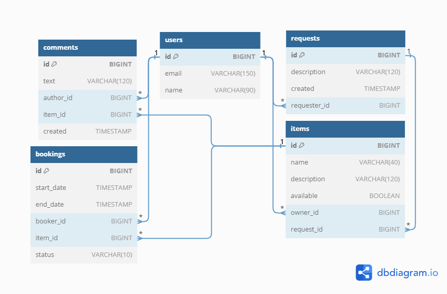

# ShareIt
####
### General
#### The project was completed as part of a task on Yandex practicum.
This project provides an opportunity for users to tell what things they are willing to share, 
and find the right thing and book it for a while. Users can also create requests to add things 
with the necessary functionality and comment on items.

ShareIt implements a microserver architecture using docker for containerization. The project provides the user with a 
REST API for interaction.

### Technology stack: 

- [Java 11](https://docs.aws.amazon.com/corretto/latest/corretto-11-ug/downloads-list.html) 
- [Spring](https://start.spring.io) (Boot, MVC, Data JPA), 
- [PostgreSQL](https://www.enterprisedb.com/downloads/postgres-postgresql-downloads) 
- [Docker](https://www.docker.com/products/docker-desktop/), Docker-compose
- [Maven](https://www.enterprisedb.com/downloads/postgres-postgresql-downloads)

#### Also used
- Hibernate ORM
- lombok
- JUnit, Mockito, H2

### ER-diagram:

